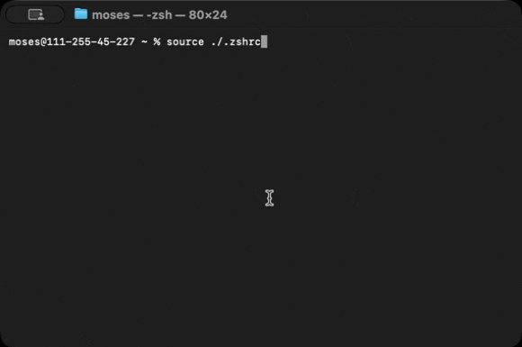
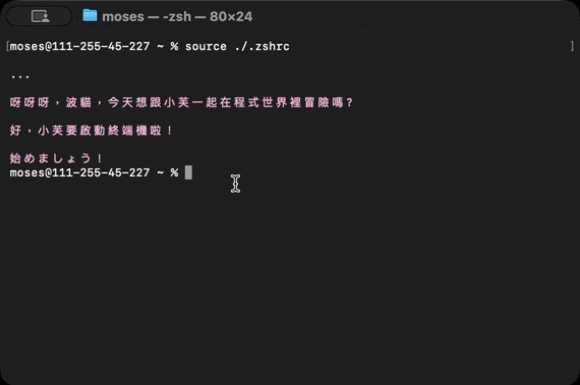

# 大幅降低效率的小芙終端機安裝教學與指令表
## (MacOS)
---
## 版本日誌
2025/7/11 v0.3

1.**新增了檢查更新的指令**

2.修了一些Bug

3.修復了錯誤複寫.zshrc的問題


## 指令說明

1. **這裡寫什麼？**  
```bash
這裡寫什麼？ /到/文件/的/路徑/文件.txt
```
   小芙會把指定文件讀出來喔！

2. **啟動歡迎語**(非指令)


   
3. **小芙，檢查更新**
```bash
小芙，檢查更新
```
檢查現在版本是不是跟GitHub上的最新版符合

4. **小芙，你可以幫我什麼？**
```bash
小芙，你能幫我什麼？
```
顯示指令列表




---

## 安裝教學

1. 從 GitHub 取得小芙終端機

```bash
git clone https://github.com/Bomao-code-for-nothing/xiaofu-s-terminal
cd xiaofu-s-terminal
```

2.執行安裝腳本
```bash
./install.sh
```
3.大功告成，重啟終端機讓指令生效
```bash
cd ~/
source ./.zshrc
```

## 如何解除安裝
方法1.**修改.zshrc**
```
open ./
按下：Command+shift+.
右鍵，以任意文字編輯器打開，把小芙終端機的部分刪除
```
方法2.**等待我推出解除安裝工具：D**
